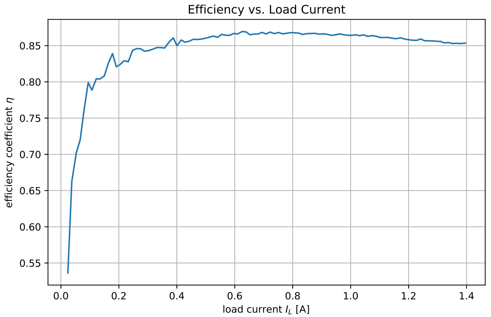

# GPIB / IEEE 488 PythonDeviceWrapper

---

Wrapper for several GPIB controllable devices.

(work in progress)

The goal of this project is, to enable easy scripting of measurement procedures using a higher abstracction layer for GPIB devices.

---

[](https://www.python.org/)

---

## Results



Efficiency curve of a 12V to 5V DC/DC converter. Measured using the NGMO2.

---

### Example

```python
import time
import interface.prologix_gpib as prologix
import devices.schlumberger_7150plus as schlumberger

import numpy as np
import matplotlib.pyplot as plt

iface = prologix.usb(com='ASRL31::INSTR', baudrate=19200, timeout=5000)
iface.loc()  # Lokaler Modus
schlumi = schlumberger.device(iface, 13)

values = np.zeros(100)              # leeres Array mit 100 Werten
for i in range(0, len(values)):
    schlumi.trigger()               # single shot
    values[i] = schlumi.read()      # Wert lesen
    time.sleep(0.1)                 # 100ms warten

plt.plot(values)                    # plotten
plt.ylabel('U [V]')
plt.xlabel('Messung Nr.')

```

##### Example 2

```python
import interface.prologix_gpib as prologix
import devices.rohde_schwarz_ngmo2 as ngmo

iface = prologix.usb(com='ASRL1::INSTR', baudrate=19200, timeout=2000)

battery = ngmo.device(iface, 7)  # ngmo at address 7
battery.set_voltage('A', 12.4)   # set to 12.4 V
battery.set_output('A', True)    # turn on
```

---

### Installation (Python / Windows)

- [Anaconda.org](https://www.anaconda.com/distribution/)

---

### Resources

#### Manuals

- [Prologix GPIB-USB (HPIB-USB) Controller](http://prologix.biz/gpib-usb-controller.html)
- [HP 3488A Switch/Control Unit](https://www.keysight.com/en/pd-1000001304%3Aepsg%3Apro/switch-control-unit?cc=CH&lc=ger)

**Multimeter**

- [HP 3455A 5 or 6-Digit Digital Multimeter/Voltmeter](https://www.keysight.com/de/pd-3455A%3Aepsg%3Apro-pn-3455A/5-or-6-digit-digital-multimeter-voltmeter?cc=CH&lc=ger)
- [HP 3456A 6 1/2 Digit Digital Multimeter](https://www.keysight.com/en/pd-3456A%3Aepsg%3Apro-pn-3456A/6-1-2-digit-digital-multimeter?cc=CH&lc=ger)
- [Schlumberger 7150plus Digital Multimeter](http://bee.mif.pg.gda.pl/ciasteczkowypotwor/Solartron/Solartron_Schlumberger_7150_Plus_User_Manual.pdf)
- [Rohde & Schwarz NGMO2 Dual-Channel Analyzer/Power Supply](https://www.rohde-schwarz.com/ch/produkt/ngmo2-produkt-startseite_63493-8304.html)

**PSU**

- [HP 6632A, 6633A, 6634A DC Power Supply](https://www.keysight.com/de/pd-6634A%3Aepsg%3Apro-pn-6634A/gpib-dc-power-supply-0-100-vdc-0-1-a)
- [HP 6621A-6624A, 6627A / 6625A, 6626A, 6628A, 6629A DC Power Supplies](https://www.keysight.com/de/pd-836781-pn-6623A/precision-system-power-supply-80w-3-outputs)


---

#### GPIB

- [GPIB Tutorial (psi.ch)](http://lmu.web.psi.ch/docu/manuals/software_manuals/GPIB/GPIB_tutorial.pdf)
- [Overview of GPIB protocol (omega.com)](https://www.omega.co.uk/temperature/z/overviewieee.html)
- [What is GPIB / IEEE 488 Bus (electronics-notes.com)](https://www.electronics-notes.com/articles/test-methods/gpib-ieee-488-bus/what-is-gpib-ieee488.php)
- [IEEE-488 Tutorial (l-com.com)](http://www.l-com.com/multimedia/catalog_page/lc004_ieee-488_tutorial.pdf)

#### Python

- [PyVisa](https://pyvisa.readthedocs.io/en/master/)


